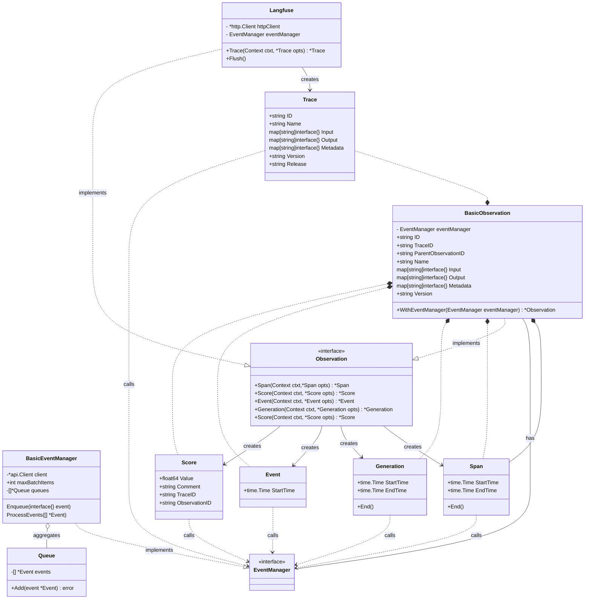

# Langfuse Go SDK
## Installation
```bash
go get github.com/wepala/langfuse-go
```
Langchain documentation: https://docs.langfuse.com/langchain

## Usage

```go
package main

import (
	"github.com/wepala/langfuse-go/langfuse"
	"net/http"
	"context"
)

func main() {
	sdk := langfuse.New(&langfuse.Options{
		HttpClient: &http.Client{},
		SecretKey:  "secret-key",
		PublicKey:  "public-key",
	})
	ctxt := context.Background()
	trace := sdk.Trace(ctxt, &langfuse.Trace{
		ID:        "request-id",
		Name:      "trace-name",
		UserID:    "user-id",
		SessionID: "session-id",
	})
	span := trace.Span(ctxt, &langfuse.SpanOptions{
		Name: "span-name",
	})
	span.Generation(ctxt, &langfuse.GenerationOptions{
		GenerationId: "generation-id",
		Attributes: map[string]interface{}{
			"key": "value",
		},
	})
	span.End()
}
```

### Development 

#### Architecture

